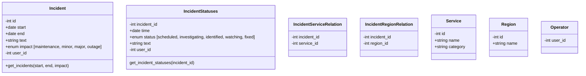

# Status Dashboard

## Trying it out

```
tox -e py39
source .tox/py39/bin/activate
flask A status_dashboard.py --debug run
```

## Bootstraping

It is possible to bootstrap DB with some initial data

```
flask boostrap provision
```

## Architecture

As stupidly simple as possible:

- flask to impement "API" and render web
- web pages without JavaScript logic (kiss and working with JS blockers)
- DB (using through sqlalchemy)
- bootstrap
- auth to be done with OpenID connect
- services are representing what should be verified (working or not)
- service_category - meta grouping of services into groups
- regions - different services are existing in regions (many to many relation)
- incidents - entry about issues affecting certain regions and certain services
- incident_status - change history (or incident updates)


Initial sketch diagram (no 100% matching reality)



A real data model is however represented in https://github.com/stackmon/status-dashboard/blob/main/app/models.py
