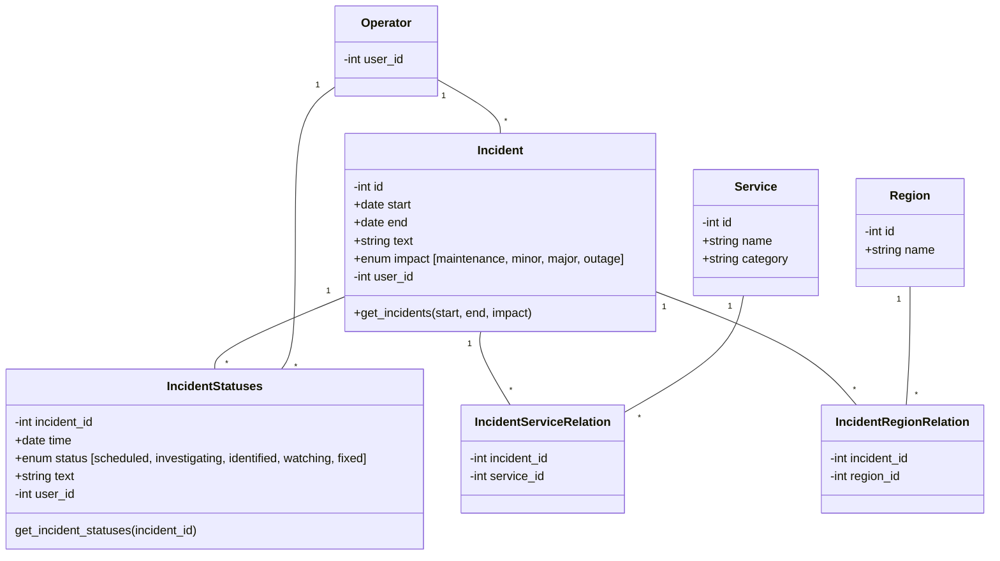

# Status Dashboard

## Trying it out

```
tox -e py39
source .tox/py39/bin/activate
flask A status_dashboard.py --debug run
```

## Bootstraping

It is possible to bootstrap DB with some initial data

```
flask boostrap provision
```

## DB Architecture



